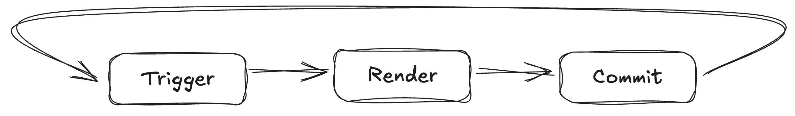

# leact - trying to master react as junior dev

Don't attempt to read it, it's just me trying to understand how React and hooks work.

I have little bit less than a year of working experience in React, but always I feel that I have knowledge gaps on how React works. Especially when it comes to hooks like, useCallback, useMemo, useRef. I know the reason why we use each one but it seems like I have a difficulty on using them on my code. They usually appear when an LLM suggest me to do. So I have decided to start from the basics and document my progress, difficulties that I found and if eventually I have learned anything. After the comlpetion of the websocket server from scratch with C#, I learned a lot about network programming and how the server and client communicate. I even learned how to read and deconstruct a frame, which is very interesting. My goal was to just understand how the websockets are working, I knew from a high perspective how they work, but I didn't really understand what is happening behind the scenes. So digging lower it really benefited me on understanding how the websockets work. The same goal I have with this project. Instead of jumping into a project and just code my way to the end result, or to just complete a ticket, create a feature, without really getting some knowledge, I decided to go deep and document each step.

Starting from just an html file and inline import the React into the project, instead of just executing a command and just magic, boom, you got everything ready to code. Trust me, if you are a junior developer I think there is a probability that you don't know how to connect the css file with the html file. I'm not saying by any means that it's essential to know, you can just google it and find it within a minute. But isn't that showing we don't dig enough to understand how the code works. I think that's the problem with the gaps in my knowledge. We depend a lot on the LLMs, without understanding the basics. Just propmt your way into the solution. But if you stuck on a harder task? If you need to debug? But you don't have the idea how it works? Then you just depend on your senior or a lucky prompt to rescue you. To be honest I'm using LLMs to finish a lot of tickets in my work and I do it because of the time pressure, or maybe I'm the problem and I'm slow. Maybe. But the point it that I'm not getting the satisfaction. The satisfaction of solving a problem and having the aha moment. Even on the harded tasks, if I use the help of an LLM I don't get the satisfaction. So I started using it just like google and adding the phrase "Don't code". I want to give me the steps on how I can find the solution. Maybe also that is the problem. I'm not thinking on the path to find the solution, which maybe is necessary to solve hard problems. Anyway let's continue. That's something that I can analyze on a different project.

Created the html file, added the necessary tags. Like html, head, body, script. And now? We have to somehow start scripting I guess. So I new the way to do that just started with an easy console log in the script tags. Now we need to render a component on the page. So I did the below

    <body>
    	
    </body>

Guess what. Nothing get's displayed. Why? I though that just by returning the div, it would be displayed on the page. Yeah it didn't. So started searching and found that I need to install react-dom. React-dom we need it to render the components to the page! That's what we are missing right now. So I will need to create a div add the attribute id and name it root or whatever. Then we need to use the createRoot function that will return an object where inside that object is the render method. In that method we need to pass the component that we want to render into the page. Okay let's refresh aaand still we got errors. Why?

Because we have JSX and in order to use JSX we need React. So let's inline import react using cdn. Aaand still nothing. So I continue searching I find that browser cannot read JSX, so we need something to compile to js and that is babel. Let's inline import babel also and don't forget to add the type attribute into script tag type="text/babel", otherwise it cannot find what to compile. Here is the end result:

    <!DOCTYPE html>
    <html>
        <header>
            <title>Mastering React</title>
            
            
            
        </header>

        <body>
            

            
        </body>
    </html>

You notice that we used useState to store the count. We did that because when the count changes we would like to re-render the component so the displayed count is changed. Please note that states are immutable, meaning that we can't directly change a state.

Now I wanted to use useRef. Unfortunately I didn't remember a lot. I knew just that is used on a ref attribute that elements have to change a value. It does that but it's also can be used like useState, to store a value. But note that there are some differences between useState and useRef. First, the useRef is mutable, meaning you could change the value directly, unlike useState. Second, changes to the value do not cause re-renders, unlike useState. And lastly you can assign the useRef object to an element attribute and but accessing the current property of the ref gives you direct access to the dom node, allowing you to manipulate it (not sure if that's all, just saying what I remember from reading the documentation yesterday xD).

Let's try to add a ref example in our code. From the examples in the documentation the only one I found a bit hard to implement is the timer. Not the why we use useRef but the way you have to store the start and now date in a state and then create an interval where it needs an id. This id is stored in a useRef, becaused it's mutable and mutating the value will not cause a re-render. I will provide the link for the push commit instead of copy-pasting the code https://github.com/victoras24/leact/commit/8e6cc35ab0949b7150412c03d77c0039c529e4c0 .

Looking at the code now, I'm thinking maybe I should create a new file for each hook. Maybe it will look cleaner.

It's time fore useCallback hook. I didn't know a lot about it, before reading the documentation I just knew that you use it to optimize functions (i was wrong xD). Let me explain with simple words where you can use useCallback hook. First of all, useCallback, consists of 2 parameter, the first one is the function that you want to cache and the second one are the dependencies array. It's important to remember that functions and objects in javascript are re-created, re-produced on every render! So the useCallback hoock comes to cache the function that you passes, to cache the reference of the function, in order to avoid re renders of the reference. If the dependencies you set, do not change then the function reference remains the same. If you set the dependency array empty it means that the function will be created only in the initial render and then it will remain the same one.

Now let's talk about useEffect. It's a hook I have used mainly for initial render of a component. I knew also that the useEffect runs when a dependency changes. Not much to be honest. Just looking at how is done from other components and copy pasting the hook. Trying to find a similar one and copy paste the logic. Reading the documentation the last 2 days changed a lot from that and hopefully I could apply them to the next code lines. So, what is useEffect and when to use it? Again in simple words, it's a hook that is used to run code that's not controlled from React. For example, fetching data from an api, using some browser API or third party librarys. Those all are external because are not controlled by React. In order to connect the component to some of those external system we are using useEffect.
How the structure of useEffect looks. It's similar to useCallback, there is a function and an array of dependencies. Just a difference in useEffect you could use return function that is called the cleanup function, we will talk about that later.
Also it's important to mention that a useEffect runs on every render (if no dependencies are set) and that it runs after the render phase. So first the components get rendered and then useEffect runs. In the commit https://github.com/victoras24/leact/commit/e46ede09956df37a26706681ffbee0ad6133773d I have combined the use of useRef, useCallback and useEffect. Starting of we create a ref that the initial value is null. Why ref? Because we need to to hold the value of the previous ref, something that it cannot happened to the state because on each render it's different object and if you change it it means the object changes meaning it will cause re-renders. Then we create function and we wrap it with the useCallback hooks and we set an empty dependency array, meaning that the object reference of the function will be created once and never change again. How we could prove that? we can say that if the previous ref value is === to the function that we wrapped with the useCallback hook to console something, else, meaning that the object reference of the function is changed. Try running it and notice the console logs. The first one is "function ref is changed" because as we said the useCallback dependency array is set empty, meaning that will be created on the first render. Now trigger a re-render by clicking the click me button. Notice that the console log now it says "is the same ref". That's happening because the prevRef.current is equal to the function that is wrapped with the useCallback. Try to remove the useCallback and notice the difference.
You will ask now, what about the useEffect? With the useEffect it's a way to show you that the useEffect runs last. Just move the line prevRef.current = doSomething; outside the useEffect. What you think will happen now? Now React will set first the ref equal to the function, meaning that even the first render will console log "is the same ref". That's something that I got only after playing around with the code my self. No chat gpt prompts to explain, just by reading the documentation and playing around with simple lines of code. We think that we know the basics but we are wrong.

In React there are 3 phases:

- Trigger
- Render
- Commit

Use Effect Takes place at the commit phase. So after the render of the body react commits the changes, because react uses Object.is to check if any dependency of the useEffect is chanaged and commit only the changed ones.

We didn't talk about the cleanup function that is used in useEffect. It's important to know that the cleanup runs on the unmount of the component, thus leaving the page runs the cleanup function. Also in the development, if strict mode is enabled, adding console logs, you will notice that it's logging twice. You will see the useEffect function run on mount, test run the cleanup function and then run again the function, as the initial run. So don't try to remove the first 2 test runs, as I tried to do xD. Check the commit https://github.com/victoras24/leact/commit/880510dc4de0824dad243991baf5d63112f27ada I have create a function named cleanup just to show how cleanup works. So run the code and notice that on the initial run that the useEffect function runs after the components. Changing a room, triggers the cleanup function, as the dependency we set it's the roomId, meaning that the component unmounts and get's ready to re-render, before it unmounts, the cleanup function runs.
